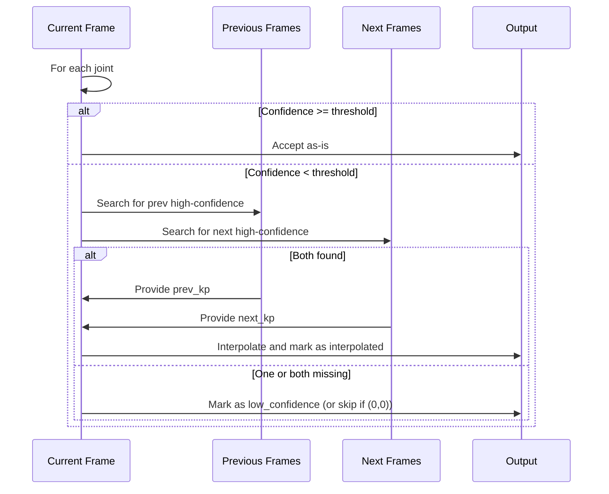

# Confidence Scores in AmbientPose

This document explains how **joint confidence** and **pose confidence** are computed and handled in the AmbientPose CLI, for each supported backend. It also provides guidance and code examples for filtering out low-confidence joints and performing interpolation across frames.

---

## Table of Contents

1. [Overview: What is Confidence?](#overview-what-is-confidence)
2. [How Each Detector Computes Confidence](#how-each-detector-computes-confidence)
    - [MediaPipe](#mediapipe)
    - [Ultralytics YOLO](#ultralytics-yolo)
    - [AlphaPose](#alphapose)
    - [OpenPose](#openpose)
3. [Where Confidence is Used in the Code](#where-confidence-is-used-in-the-code)
4. [Filtering Low-Confidence Joints](#filtering-low-confidence-joints)
    - [Where to Add Filtering Logic](#where-to-add-filtering-logic)
    - [Example: Filtering and Interpolation](#example-filtering-and-interpolation)
5. [Best Practices and Recommendations](#best-practices-and-recommendations)

---

## Overview: What is Confidence?

- **Joint confidence**: A value (usually between 0 and 1) representing the model's certainty that a detected keypoint (joint) is correct.
- **Pose confidence**: A value (usually between 0 and 1) representing the overall confidence in the detected pose (person), often computed as the average or minimum of the joint confidences, or as a separate detection score.

These values are used to filter out unreliable detections and to inform downstream analysis (e.g., gait analysis, tracking).

---

## How Each Detector Computes Confidence

### MediaPipe

- **Joint confidence**: Uses the `visibility` attribute of each landmark (see [MediaPipe docs](https://google.github.io/mediapipe/solutions/pose.html)).
- **Pose confidence**: Always set to `1.0` (since MediaPipe does not provide an overall pose score).

**Relevant code:**
- [`MediaPipeDetector.detect_poses`](../cli/detect.py#L410)

```python
# For each landmark:
confidence = lm.visibility if hasattr(lm, 'visibility') else 1.0
keypoints.append([x, y, confidence])
...
pose = {
    ...
    'score': 1.0,  # pose confidence
    'keypoints': keypoints,  # list of [x, y, confidence]
    ...
}
```

**Example:**
- If a left wrist is detected at (x=100, y=200) with visibility 0.85, the keypoint is `[100, 200, 0.85]`.

### Ultralytics YOLO

- **Joint confidence**: Provided as the third value in each keypoint (from YOLOv8 output, typically between 0 and 1).
- **Pose confidence**: The detection confidence of the bounding box (`box.conf`).

**Relevant code:**
- [`UltralyticsDetector.detect_poses`](../cli/detect.py#L568)

```python
# For each keypoint:
x, y, conf = kpts_data[j]
keypoints_list.append([float(x), float(y), float(conf)])
...
pose = {
    ...
    'score': float(box_conf),  # pose confidence
    'keypoints': keypoints_list,
    ...
}
```

**Example:**
- A right ankle detected at (x=320, y=480) with confidence 0.42: `[320, 480, 0.42]`.
- The pose's bounding box has confidence 0.91.

### AlphaPose

- **Joint confidence**: Extracted from the heatmap maxima for each joint (see `heatmap_to_coord_simple`).
- **Pose confidence**: The detection confidence from the human detector (YOLOX or fallback).

**Relevant code:**
- [`AlphaPoseDetector.detect_poses`](../cli/detect.py#L878)

```python
# For each joint:
x_coord = float(coords[j, 0])
y_coord = float(coords[j, 1])
confidence = float(maxvals[j, 0])
keypoints.append([x_coord, y_coord, confidence])
...
pose = {
    ...
    'score': float(det_conf),  # pose confidence
    'keypoints': keypoints,
    ...
}
```

**Example:**
- A left knee at (x=150, y=300) with confidence 0.67: `[150, 300, 0.67]`.
- The pose's detection confidence is 0.88.

### OpenPose

- **Joint confidence**: The third value in each keypoint (from OpenPose output, typically between 0 and 1).
- **Pose confidence**: The average of all valid joint confidences for the person.

**Relevant code:**
- [`OpenPoseDetector.detect_poses`](../cli/detect.py#L1366)

```python
# For each keypoint:
x, y, conf = person_keypoints[kp_idx]
...
valid_keypoints.append([float(x), float(y), float(conf)])
confidences.append(conf)
...
avg_confidence = sum(confidences) / len(confidences) if confidences else 0.0
pose = {
    ...
    'score': float(avg_confidence),  # pose confidence
    'keypoints': valid_keypoints,
    ...
}
```

**Example:**
- A right shoulder at (x=220, y=180) with confidence 0.55: `[220, 180, 0.55]`.
- The pose's average confidence is 0.62.

---

## Where Confidence is Used in the Code

- **Detection filtering**: Each detector skips detections with pose confidence below `self.config.min_confidence`.
- **Joint filtering**: By default, all joints are included, but we filter out joints with low confidence (see next section).
- **Output formatting**: In [`convert_pose_to_joints_format`](../cli/detect.py#L1753), joint and pose confidences are included in the output JSON.

---

## Filtering Low-Confidence Joints

To remove all joint points with confidence below a threshold (e.g., 0.3), we filter the `keypoints` list for each pose **after detection** and **before output**.

### Where to Add Filtering Logic

The best place to add this logic is in the `convert_pose_to_joints_format` function, which is called for every pose before saving results.

**File:** `cli/detect.py`

**Function:** `convert_pose_to_joints_format(pose, frame_number, timestamp)`

**Current code:**
```python
for i, joint_name in enumerate(joint_names):
    if i < len(keypoints):
        x, y, confidence = keypoints[i]
    else:
        x, y, confidence = 0.0, 0.0, 0.0
    # Skip keypoints at (0,0) as they are spurious/undetected
    if x == 0.0 and y == 0.0:
        continue
    joint = {
        "name": joint_name,
        "joint_id": i,
        "keypoint": {
            "x": round(float(x), 4),
            "y": round(float(y), 4), 
            "confidence": round(float(confidence), 4)
        }
    }
    joints.append(joint)
```

**To filter by confidence (e.g., 0.3):**
```python
CONFIDENCE_THRESHOLD = 0.3  # Set threshold here
...
for i, joint_name in enumerate(joint_names):
    if i < len(keypoints):
        x, y, confidence = keypoints[i]
    else:
        x, y, confidence = 0.0, 0.0, 0.0
    # Skip keypoints below confidence threshold
    if confidence < CONFIDENCE_THRESHOLD:
        continue
    joint = {
        ...
    }
    joints.append(joint)
```

### Example: Filtering and Interpolation

Suppose we want to **interpolate missing joints** (those below the threshold) using values from adjacent frames, but only if those adjacent frames have confidence above the threshold.

#### Step 1: Store Previous/Next Keypoints
- In the main processing loop (in `process_video` or `process_images`), keep a buffer of previous and next frames' keypoints for each person.

#### Step 2: Interpolate in `convert_pose_to_joints_format`
- If a joint's confidence is below the threshold, look up the same joint in previous/next frames for the same person, and interpolate if both are above threshold.

**Pseudo-code:**
```python
if confidence < CONFIDENCE_THRESHOLD:
    # Try to interpolate using previous and next frames
    prev_kp = get_joint_from_previous_frame(person_id, joint_id)
    next_kp = get_joint_from_next_frame(person_id, joint_id)
    if prev_kp and next_kp and prev_kp[2] >= CONFIDENCE_THRESHOLD and next_kp[2] >= CONFIDENCE_THRESHOLD:
        # Linear interpolation
        x = (prev_kp[0] + next_kp[0]) / 2
        y = (prev_kp[1] + next_kp[1]) / 2
        confidence = min(prev_kp[2], next_kp[2])  # Conservative
    else:
        continue  # Skip this joint
```

**Where to implement:**
- We should need to extend the data structures in `PoseDetector` to keep a history of keypoints per person.
- Add helper functions to retrieve previous/next keypoints for interpolation.

#### Example Scenario
- Frame 10: Left ankle confidence = 0.2 (below threshold)
- Frame 9: Left ankle confidence = 0.8 (above threshold), position (x1, y1)
- Frame 11: Left ankle confidence = 0.7 (above threshold), position (x2, y2)
- **Interpolated value for frame 10:**
    - x = (x1 + x2) / 2
    - y = (y1 + y2) / 2
    - confidence = min(0.8, 0.7) = 0.7

---

## How Low-Confidence Joints Are Interpolated or Filtered

AmbientPose provides a robust mechanism for handling joint points with low confidence. This ensures that the output is both reliable and as complete as possible, even when some detections are uncertain or missing.

### Decision Process: Interpolate or Filter?

For each joint in each frame, the following logic is applied:

1. **If the joint's confidence is above the threshold** (`min_joint_confidence`, default 0.3):
    - The joint is accepted as-is.
2. **If the joint's confidence is below the threshold:**
    - The system attempts to interpolate the joint's position using the same joint from previous and next frames (for the same person) **if both sides have high-confidence detections**.
    - If both a previous and next high-confidence value exist, the joint is linearly interpolated.
    - If either side is missing a high-confidence value, the joint is marked as low confidence and is not interpolated.
    - If the joint's coordinates are (0, 0), it is skipped entirely (not included in the output).

#### Step-by-Step Algorithm

```text
For each joint in each frame:
    If confidence >= min_joint_confidence:
        Accept joint as-is
    Else:
        Find previous frame with high-confidence for this joint (prev_kp)
        Find next frame with high-confidence for this joint (next_kp)
        If prev_kp and next_kp exist:
            Interpolate:
                x = (prev_kp.x + next_kp.x) / 2
                y = (prev_kp.y + next_kp.y) / 2
                confidence = min(prev_kp.conf, next_kp.conf)
            Mark joint as interpolated
        Else:
            Mark joint as low confidence
        If joint coordinates are (0, 0):
            Skip (do not include in output)
```

### Formal Algorithm: Robust Filtering and Interpolation of Low-Confidence Joints

**Input:**
- For each frame \( f \) in a sequence \( F \), a set of detected poses \( P_f \).
- For each pose \( p \in P_f \), a set of joints \( J_p = \{j_1, j_2, ..., j_n\} \), where each joint \( j_i \) is a tuple \((x, y, c)\) with coordinates \((x, y)\) and confidence \(c \in [0, 1]\).
- A minimum joint confidence threshold \( \tau \) (e.g., 0.3).
- For each person, a mapping of joint histories across frames.

**Output:**
- For each pose in each frame, a filtered and possibly interpolated set of joints, with metadata indicating whether each joint is interpolated, low-confidence, or accepted as-is.

---

#### Pseudocode

```text
For each frame f in F:
    For each pose p in P_f:
        For each joint index i in 1..n:
            (x, y, c) ← p.joints[i]
            If (x == 0 and y == 0):
                // Spurious or undetected joint, skip
                Continue to next joint

            If c ≥ τ:
                // High-confidence joint, accept as-is
                Output joint:
                    name: joint_name[i]
                    joint_id: i
                    keypoint: { x, y, confidence: c, interpolated: false, low_confidence: false }
                Continue to next joint

            // Low-confidence joint, attempt interpolation
            prev_kp ← Find most recent previous frame f_prev < f where
                        person_id matches p and
                        joint i has confidence ≥ τ

            next_kp ← Find earliest next frame f_next > f where
                        person_id matches p and
                        joint i has confidence ≥ τ

            If prev_kp ≠ null and next_kp ≠ null:
                // Both sides available, interpolate
                x_interp ← (prev_kp.x + next_kp.x) / 2
                y_interp ← (prev_kp.y + next_kp.y) / 2
                c_interp ← min(prev_kp.confidence, next_kp.confidence)
                Output joint:
                    name: joint_name[i]
                    joint_id: i
                    keypoint: { x: x_interp, y: y_interp, confidence: c_interp, interpolated: true, low_confidence: false }
            Else:
                // Cannot interpolate, mark as low-confidence
                Output joint:
                    name: joint_name[i]
                    joint_id: i
                    keypoint: { x, y, confidence: c, interpolated: false, low_confidence: true }
```

---

**Algorithm Explanation**

1. **High-Confidence Acceptance:**
   - If a joint's confidence \( c \) meets or exceeds the threshold \( \tau \), it is accepted without modification.
2. **Filtering of Spurious Joints:**
   - Joints with coordinates \((0, 0)\) are considered undetected and are omitted from the output.
3. **Interpolation of Low-Confidence Joints:**
   - For joints with \( c < \tau \), the algorithm searches for the same joint in both the most recent previous and earliest next frames (for the same person) where the joint's confidence is at least \( \tau \).
   - If both are found, the joint's position is linearly interpolated, and its confidence is set to the minimum of the two. The joint is marked as `interpolated: true`.
4. **Low-Confidence Marking:**
   - If interpolation is not possible (i.e., one or both adjacent high-confidence joints are missing), the joint is retained but marked as `low_confidence: true`.
5. **Output:**
   - Each joint in the output is annotated with metadata indicating whether it was interpolated, low-confidence, or accepted as-is.

This algorithm ensures that the output pose data is both robust and informative, maximizing the use of available high-confidence information while clearly flagging uncertain or interpolated data for downstream analysis.

### Example Scenarios

#### Example 1: Interpolation Succeeds

| Frame | x    | y    | confidence |
|-------|------|------|------------|
| 10    | 100  | 200  | 0.9        |  ← high confidence
| 11    | 0    | 0    | 0.1        |  ← low confidence (to interpolate)
| 12    | 120  | 220  | 0.8        |  ← high confidence

- For frame 11, both previous (frame 10) and next (frame 12) have high confidence.
- Interpolated:
    - x = (100 + 120) / 2 = 110
    - y = (200 + 220) / 2 = 210
    - confidence = min(0.9, 0.8) = 0.8
- Marked as `interpolated: true` in the output.

#### Example 2: Interpolation Fails (Edge Case)

| Frame | x    | y    | confidence |
|-------|------|------|------------|
| 0     | 0    | 0    | 0.1        |  ← low (no previous high-confidence frame)
| 1     | 0    | 0    | 0.1        |  ← low
| 2     | 120  | 220  | 0.8        |  ← high confidence

- For frames 0 and 1, there is no previous high-confidence frame.
- No interpolation is performed; joints are marked as `low_confidence: true`.
- If coordinates are (0, 0), the joint is skipped entirely.

#### Example 3: Both Sides Low, Surrounded by High

| Frame | x    | y    | confidence |
|-------|------|------|------------|
| 10    | 100  | 200  | 0.9        |  ← high
| 11    | 0    | 0    | 0.1        |  ← low
| 12    | 0    | 0    | 0.1        |  ← low
| 13    | 120  | 220  | 0.8        |  ← high

- For frames 11 and 12, both previous (frame 10) and next (frame 13) have high confidence.
- Both are interpolated between frames 10 and 13.

#### Example 4: Low Confidence at End (No Next High)

| Frame | x    | y    | confidence |
|-------|------|------|------------|
| 8     | 100  | 200  | 0.9        |  ← high
| 9     | 0    | 0    | 0.1        |  ← low
| 10    | 0    | 0    | 0.1        |  ← low (no next high-confidence frame)

- For frame 10, there is no next high-confidence frame.
- No interpolation is performed; joint is marked as `low_confidence: true` or skipped if (0, 0).

### Output Markers
- Interpolated joints: `"interpolated": true`
- Low-confidence, not interpolated: `"low_confidence": true`
- Skipped if coordinates are (0, 0)

---

### System Architecture Diagram

```mermaid
graph TD
    A[Input Frames] --> B[Pose Detection (per frame)]
    B --> C[Joint Confidence Filtering]
    C --> D{Confidence >= Threshold?}
    D -- Yes --> E[Accept Joint]
    D -- No --> F[Check History for Interpolation]
    F -- Both Sides High --> G[Interpolate Joint]
    F -- One/Both Sides Missing --> H[Mark as Low Confidence or Skip]
    E & G & H --> I[Output Formatting]
    I --> J[Export JSON/CSV]
```

---

### Interaction Diagram: Joint Filtering & Interpolation



---

## Best Practices and Recommendations

- **Set a reasonable confidence threshold** for the application (e.g., 0.3 for visualization, 0.5+ for analytics).
- **Always filter out low-confidence joints** before using the data for downstream tasks.
- **Interpolate missing joints** only if we have high-confidence values in adjacent frames.
- **Document any changes** to the filtering/interpolation logic for reproducibility.

---

## References
- [MediaPipe Pose Documentation](https://google.github.io/mediapipe/solutions/pose.html)
- [Ultralytics YOLOv8 Keypoints](https://docs.ultralytics.com/tasks/pose/)
- [AlphaPose Documentation](https://github.com/MVIG-SJTU/AlphaPose)
- [OpenPose Documentation](https://github.com/CMU-Perceptual-Computing-Lab/openpose)

---

For further questions, see the code comments in [`cli/detect.py`](../cli/detect.py) or contact the project maintainer. 