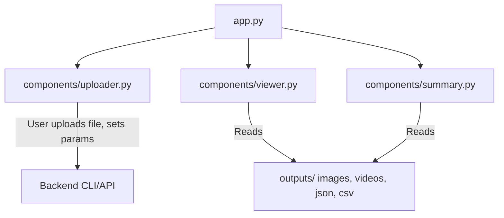

# AmbientPose Streamlit Frontend Documentation

## Overview
This frontend provides an interactive, extensible UI for running and exploring pose detection results from AmbientPose. It is built with Streamlit and follows best OOP, SOLID, and DRY software engineering practices.

## Features
- Upload videos or image directories for detection
- Select backend and detection parameters
- View output images, videos, JSON, and CSV
- Visualize summary statistics and pose data (Plotly)
- Modular, maintainable codebase

## Directory Structure
```
frontend/
  app.py
  pyproject.toml
  README.md
  components/
    __init__.py
    uploader.py
    viewer.py
    summary.py
```

## Installation & Usage (with `uv`)

> **Note:** This project uses [`uv`](https://github.com/astral-sh/uv) for fast, modern Python dependency management. If you see a TOML parse error, ensure your `pyproject.toml` has dependencies as a list, not a table (see below).

### 1. Install `uv`
- **Windows PowerShell:**
  ```powershell
  pip install uv
  # Or with pipx (recommended):
  pipx install uv
  ```
- **Mac/Linux (bash/zsh):**
  ```bash
  pip install uv
  # Or with pipx (recommended):
  pipx install uv
  ```

### 2. Set up the frontend environment
- **All platforms:**
  ```bash
  cd frontend
  uv venv
  uv pip install -r pyproject.toml
  ```

### 3. Run the app
- **All platforms:**
  ```bash
  streamlit run app.py
  ```

## Troubleshooting
- **TOML parse error:**
  Ensure your `pyproject.toml` dependencies section looks like this:
  ```toml
  [project]
  ...
  dependencies = [
      "streamlit>=1.35.0",
      "plotly>=5.20.0",
      ...
  ]
  ```
- See [uv documentation](https://github.com/astral-sh/uv) for more help.

## Design & Extensibility
- **OOP:** Each UI section is a class-based component (see `components/`).
- **SOLID:** Each component has a single responsibility and is open for extension.
- **DRY:** Shared logic is factored into components/utilities.
- **Extending:**
  - Add new pages/components in `components/` and update `app.py`.
  - Add new visualizations in `components/summary.py`.

## Architecture Diagram


## Backend Integration
- The uploader currently stubs backend calls. Integrate with your backend API or CLI as needed.
- For production, consider a FastAPI backend to wrap CLI calls and serve files.

## Best Practices
- Keep UI logic modular and testable.
- Use OOP for all major UI sections.
- Follow SOLID and DRY for maintainability and extensibility.

## License
MIT 