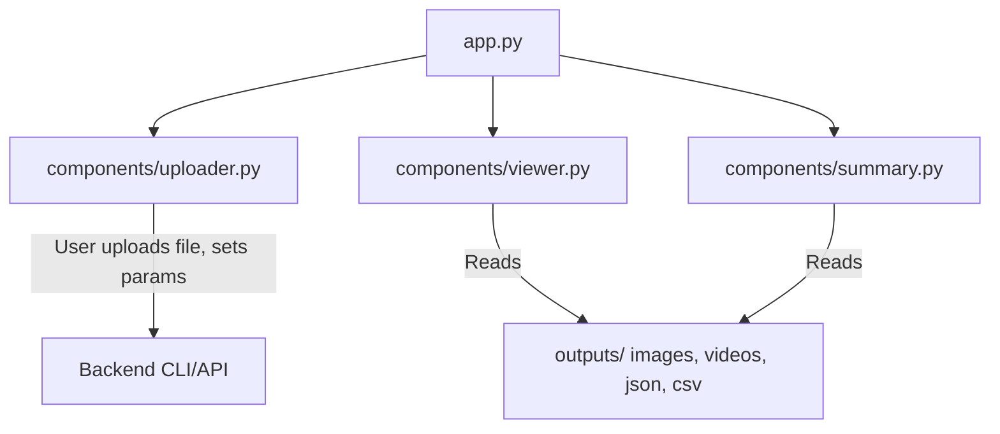

# AmbientPose Streamlit Frontend

A customizable, extensible, and maintainable Streamlit-based frontend for interactive usage of AmbientPose's pose detection CLI and outputs (images, JSON, CSV, videos).

## Features
- Upload video or image data and select detection parameters
- View and browse output images, videos, JSON, and CSV
- Visualize summary statistics and pose data interactively (Plotly)
- Modular OOP design (SOLID, DRY principles)
- Easy to extend with new pages, components, or visualizations

## Directory Structure
```
frontend/
  app.py                # Main Streamlit entry point
  pyproject.toml        # Python dependencies (uv compatible)
  README.md             # This documentation
  components/
    __init__.py         # Package marker
    uploader.py         # File upload and detection trigger UI
    viewer.py           # Output browsing and visualization UI
    summary.py          # Summary statistics and Plotly visualizations
  tests/
    components/
      test_uploader.py  # Pytest for uploader component
```

## Installation (with `uv`)

> **Note:** This project uses [`uv`](https://github.com/astral-sh/uv) for fast, modern Python dependency management. If you see a TOML parse error, ensure your `pyproject.toml` has dependencies as a list, not a table (see below).

### 1. Install `uv`
- **Windows PowerShell:**
  ```powershell
  pip install uv
  # Or with pipx (recommended):
  pipx install uv
  ```
- **Mac/Linux (bash/zsh):**
  ```bash
  pip install uv
  # Or with pipx (recommended):
  pipx install uv
  ```

### 2. Set up the frontend environment
- **All platforms:**
  ```bash
  cd frontend
  uv venv
  uv pip install -r pyproject.toml
  ```

## Usage
- **All platforms:**
  ```bash
  uv venv
  uv pip install -r pyproject.toml
  streamlit run app.py
  ```

## Running Tests
- **Activate the frontend virtual environment first!**

- **Windows PowerShell:**
  ```powershell
  cd frontend
  .venv\Scripts\Activate.ps1
  pytest tests/components/test_uploader.py -v
  ```
- **Mac/Linux (bash/zsh):**
  ```bash
  cd frontend
  source .venv/bin/activate
  pytest tests/components/test_uploader.py -v
  ```

- If you see `ModuleNotFoundError: No module named 'streamlit'`, make sure you are using the frontend venv.

## Troubleshooting
- **TOML parse error:**
  Ensure your `pyproject.toml` dependencies section looks like this:
  ```toml
  [project]
  ...
  dependencies = [
      "streamlit>=1.35.0",
      "plotly>=5.20.0",
      ...
  ]
  ```
- See [uv documentation](https://github.com/astral-sh/uv) for more help.

## Extending the App
- Add new pages by creating new components and updating `app.py`.
- Add new visualizations in `components/summary.py`.
- Follow OOP and SOLID/DRY principles: keep logic modular, reusable, and testable.

## Architecture (Mermaid)


## Design Principles
- **OOP:** Each UI section is a class-based component.
- **SOLID:** Each component has a single responsibility, is open for extension, and easy to maintain.
- **DRY:** Shared logic is factored into components/utilities.

## Backend Integration
- The current uploader is a stub; integrate with your backend API or CLI as needed.
- For production, consider using FastAPI as a backend and calling the CLI via subprocess or API.

## License
MIT 